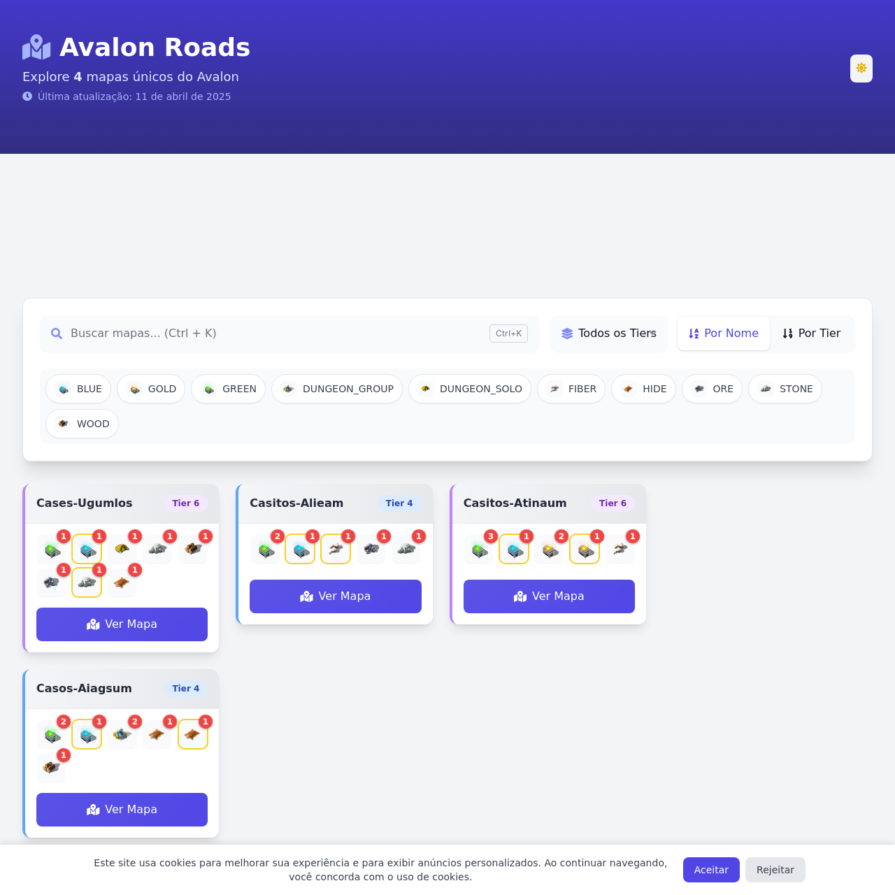

# Avalon Roads | Albion Online Maps Explorer - <https://avalonroads.noktech.com.br/>

An interactive explorer for Albion Online's Roads of Avalon maps, built with Astro, TypeScript, and Tailwind CSS. Easily navigate through all Avalon Roads maps, find resources, chests, and dungeons.

## About the Avalon Roads Project

Avalon Roads is an essential tool for Albion Online players who explore the Roads of Avalon. This web application allows:

- 🗺️ Complete navigation and search of all Avalon Roads maps
- 🔍 Advanced filtering by resources, chests, dungeons, and tiers
- 🌓 Light/dark mode with system preference support
- 🎯 Detailed resource type indicators with tooltips
- ⌨️ Keyboard shortcuts for quick navigation
- 📱 Fully responsive design for desktop and mobile

## Why Use Avalon Roads?

The Roads of Avalon are an essential part of the Albion Online world, offering unique opportunities for small group PvP, resource farming, and access to exclusive areas. Our tool helps players:

- Find Albion Avalon maps with specific resources (ore, wood, fiber, stone, hide)
- Locate valuable chests in the Roads of Avalon
- Discover dungeons for PvE in the Roads of Avalon
- Plan efficient routes through the Avalon Roads

## Technology Stack

- [Astro](https://astro.build) - Static Site Generator
- [TypeScript](https://www.typescriptlang.org/) - Type Safety
- [Tailwind CSS](https://tailwindcss.com) - Styling
- [Font Awesome](https://fontawesome.com) - Icons
- [Bun](https://bun.sh) - JavaScript Runtime and package manager

## Development

### 1. Install Bun (if you don't have it yet)

```bash
# For macOS, Linux, and WSL (Windows Subsystem for Linux)
curl -fsSL https://bun.sh/install | bash

# For Windows (via PowerShell)
powershell -c "irm bun.sh/install.ps1 | iex"
```

Verify the installation:

```bash
bun --version
```

### 2. Install dependencies

```bash
bun install
```

### 3. Start the development server

```bash
bun run dev
```

### 4. Build for production

```bash
bun run build
```

### 5. Preview the production build

```bash
bun run preview
```

## Project Structure

```text
/
├── public/
│   └── icons/           # Albion Online game resource icons
│   └── maps/            # Roads of Avalon map images
├── src/
│   ├── components/      # Reusable Astro components
│   ├── data/            # Avalon maps data in JSON format
│   ├── layouts/         # Page layouts
│   ├── pages/           # Page components
│   ├── scripts/         # Utility scripts
│   ├── types/           # TypeScript type definitions
│   └── utils/           # Utility functions
└── package.json
```

## Why Bun?

We're using Bun for several reasons:

- **Superior performance**: Up to 3x faster than Node.js for execution and package installation
- **Compatibility**: Compatible with existing npm ecosystem
- **All-in-one**: JavaScript runtime, bundler, transpiler, and package manager
- **Modern features**: Native support for TypeScript, JSX, ES modules, and other modern features

## Contributing

1. Fork the repository
2. Create your feature branch (`git checkout -b feature/new-functionality`)
3. Commit your changes (`git commit -m 'Add new functionality'`)
4. Push to the branch (`git push origin feature/new-functionality`)
5. Open a Pull Request

## Albion Online and Roads of Avalon - Useful Information

Albion Online is a sandbox MMORPG with a medieval open world, developed by Sandbox Interactive. The Roads of Avalon are a system of interconnected portals that allow travel between different areas of the game.

Characteristics of the Roads of Avalon:
- **Tier system**: From tier 1 to tier 8, with different levels of resources and dangers
- **Rare resources**: Ores, wood, fiber, stone, and hide of different tiers
- **Valuable chests**: Scattered throughout Avalon Roads maps
- **Dungeons**: PvE areas with mobs and bosses
- **Small group PvP**: Ideal for small and medium guilds

## Credits

Developed by [Brendown Ferreira](https://github.com/Br3n0k)

Part of the [AO-Noki](https://github.com/AO-Noki) organization - Tools for Albion Online

## License

This project is licensed under the MIT License - see the LICENSE file for details.

## Preview


